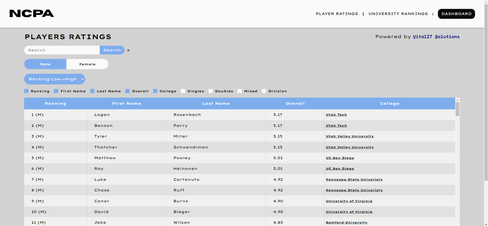
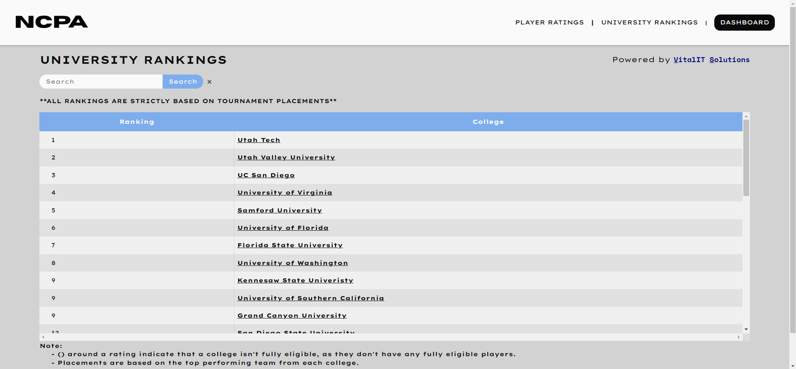
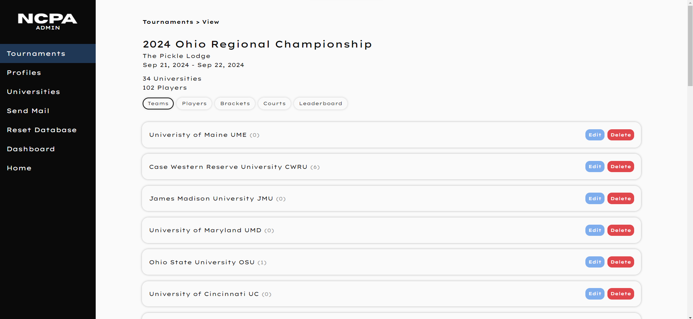
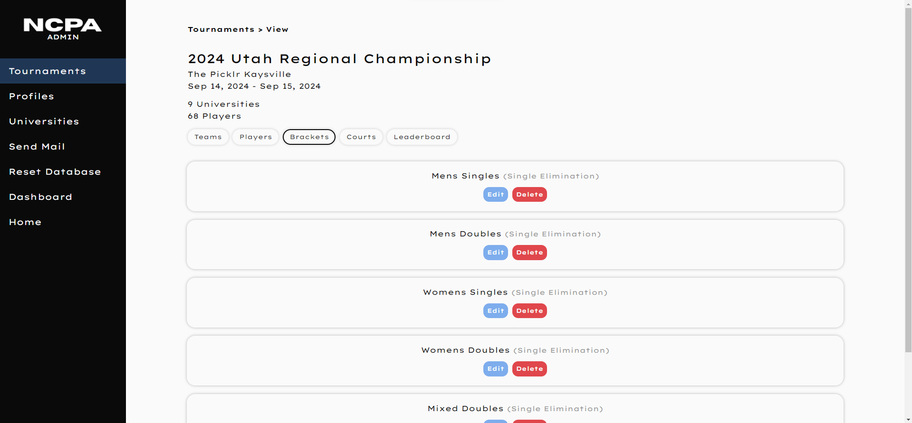
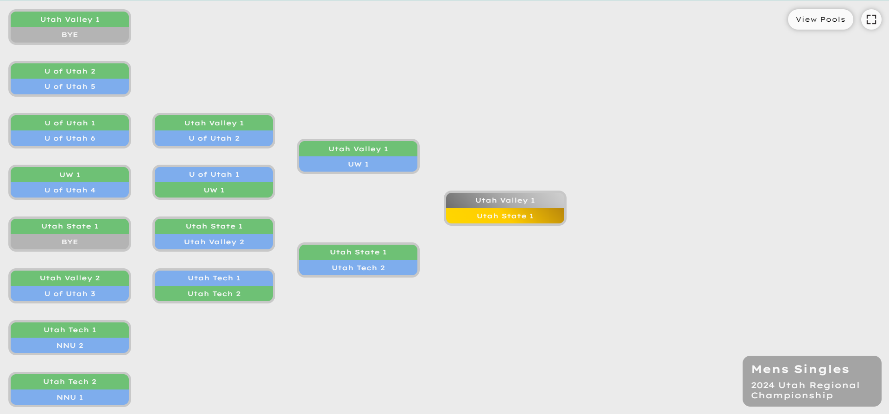
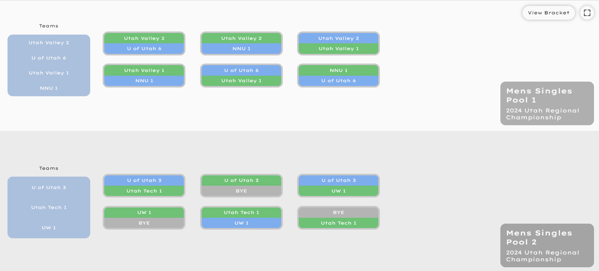

# NCPA

Website: [https://tournaments.ncpaofficial.com/](url)

This project was developed for a client through my company, VitalIT Solutions LLC, for the National Collegiate Pickleball Association (NCPA). The software includes an intuitive admin panel for managing tournaments and player profiles, along with a sleek user interface that allows players to easily create accounts, register for tournaments, and track their personal statistics.

Team captains have full control over managing their teams for both Division 1 and Division 2 events. They can invite players, accept or reject join requests, and make adjustments to their rosters. This simplifies team management, ensuring captains can handle their teams efficiently throughout the tournament.

The software features a robust real-time bracket system that updates automatically as players enter their match scores. This real-time functionality extends to a live leaderboard, which ranks both players and universities. I designed a custom rating algorithm for this system that dynamically calculates rankings based on player performance in matches. This ensures that the rankings and standings are always up-to-date, reflecting the latest results.

For in-person tournaments, the software also includes a feature to display the brackets and leaderboard on large screens or TVs. This system automatically handles the sizing and panning of the display, ensuring the information fits appropriately on any screen size. This allows participants and spectators to easily follow the tournament progress, enhancing the overall experience.

Additionally, the software integrates with Stripe to handle payments seamlessly, making it easy for both individual players and teams to register for tournaments. This integration provides a streamlined process for collecting registration fees, ensuring the tournament setup remains efficient.

There is also a built-in mailing system that allows admins to communicate directly with players, team captains, or entire teams. Admins can target specific groups based on their participation in certain tournaments or events, making it easy to send out updates, notifications, or important announcements. This functionality ensures clear and direct communication throughout the tournament, helping everything run smoothly.

This project was built with a strong backend infrastructure, designed to handle the demands of large-scale tournaments with thousands of users simultaneously. The server was developed using Node.js, which allows for efficient, non-blocking event handling. This architecture was optimized specifically for real-time performance, ensuring that the system could process a high volume of interactions without delays during tournaments. The database was created using SQL, structured to efficiently store and retrieve large amounts of player, match, and tournament data. Indexing and query optimization techniques were implemented to maintain quick response times, even when managing thousands of concurrent users.

To ensure accuracy and fairness in the player rankings, I also used Python to scrape relevant websites and gather data during the development of the custom rating algorithm. This data was essential for testing and fine-tuning the algorithm, which ranks players and universities based on performance. By automating data collection, I was able to simulate various scenarios and ensure that the algorithm could handle a wide range of input data while providing accurate, real-time updates.

This combination of a robust Node.js server, an optimized SQL database, and extensive algorithm testing helped create a highly efficient and reliable system, capable of managing tournaments at scale while delivering a smooth experience for both users and administrators.

In addition to development, I managed the hosting and server infrastructure for the software. This involved configuring and maintaining servers to ensure high availability and performance. I handled tasks such as setting up hosting environments, monitoring server performance, and implementing security measures to protect sensitive data. This comprehensive approach to server management ensured that the software remained reliable and scalable, even under high load conditions.

Developed independently, this project showcases not only my technical skills but also my ability to manage the entire development process from start to finish. I was responsible for every aspect of the project, from initial concept and design to final implementation. Beyond just the technical development of the software, I managed ongoing communication with the NCPA, ensuring that their specific needs and feedback were integrated into the system. This involved gathering detailed requirements, providing regular updates, and adapting the project based on their input to deliver a solution that exceeded expectations.

I also handled project management, organizing timelines, setting deliverables, and prioritizing features to ensure the project stayed on track and met deadlines. This included overseeing the full development lifecycle, from initial design and planning to testing and deployment, all while balancing the technical challenges with the business goals of the client. My ability to manage client relationships and maintain clear communication helped build a system that was not only technically robust but also tailored specifically to the needs of the NCPA.

This experience highlights my capacity to lead full-stack development projects independently, balancing technical excellence with strong client collaboration and project management.

